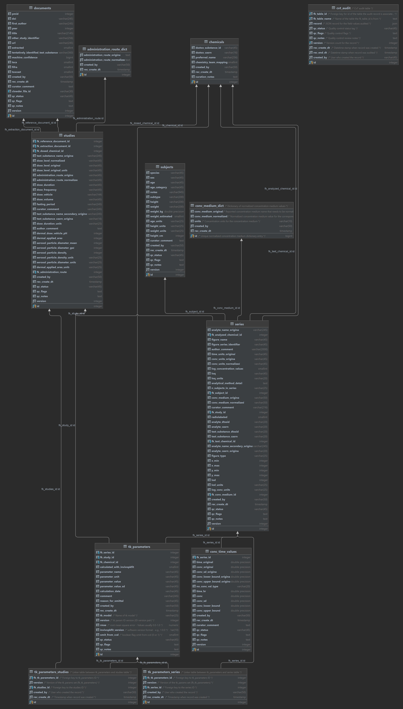

```{r, echo = FALSE, message = FALSE, warning = FALSE}
knitr::opts_chunk$set(collapse = T, comment = "#>")
options(tibble.print_min = 4L, tibble.print_max = 4L)
```

## Getting Started
### Credential Security
One of the most important considerations to make when programmatically accessing databases is how to secure your database credentials. **NEVER HARDCODE CREDENTIALS**. Each programming language provides means to externalize such information and bring it into the environment. For `R`, the `.Renviron` file is where you can store your database connection credentials to then be used by the script.

> **Note:** When using online repositories like `GitHub` or `Bitbucket`, be sure to configure your `.gitignore` files appropriately so that your externalized credentials files (e.g., `.Renviron`, `.env`, etc.) are not uploaded with your code. An example .gitignore for `R` code has been provided. See [here](https://github.com/github/gitignore) for additional examples across coding languages.

### Querying Databases
Queries can be made either by using pure SQL (as with the example `query_cvt()` helper function), or through dplyr notation (see [dplyr]( https://db.rstudio.com/r-packages/dplyr/) and [tidyverse](https://dbplyr.tidyverse.org/) for additional information).

### Database Schema Diagrams
The EER diagram shows how the tables are linked together, which help with join queries.
See [here](https://www.lucidchart.com/pages/ER-diagram-symbols-and-meaning) for help in reading the diagram.

### CvTdb EER Diagram
```{r out.height = "400px", out.width = "400px", echo = FALSE}

```

### Load required packages
```{r}
library(DBI)
library(dplyr)
library(dbplyr)
```

### Helper Functions for Connecting and Querying the Database
```{r}
#'@description A function to make a connection to the database
#'@param con_type Whether to connect to postgres, mysql, or sqlite version
#'@import DBI RMySQL RSQLite
#'@return Database connection pointer object
connect_to_db <- function(con_type){
  switch(con_type,
         "postgres" = dbConnect(RPostgreSQL::PostgreSQL(), 
                                user = Sys.getenv("postgres_user"), 
                                password = Sys.getenv("postgres_pass"), #
                                host = Sys.getenv("postgres_host"), #
                                dbname = Sys.getenv("postgres_dbname")),
         "mysql" = dbConnect(RMySQL::MySQL(), #Connect to database with .Renviron parameters
                             username = Sys.getenv("mysql_user"), 
                             password = Sys.getenv("mysql_pass"),
                             host = Sys.getenv("mysql_host"), 
                             port = 3306,
                             dbname = Sys.getenv("mysql_dbname")),
         'sqlite' = dbConnect(RSQLite::SQLite(), paste0(Sys.getenv("sqlite_dbname"), ".sqlite"))
  ) %>% return()
}

#'@description A helper function to query database and receive the results. 
#'Handles errors/warnings with tryCatch.
#'@param query A SQL query string to query the database with
#'@param con_type Whether to connect to postgres, mysql, or sqlite version
#'@param schema The schema name to use if using a postgresql connection
#'@import DBI dplyr
#'@return Dataframe of database query results
query_db <- function(query=NULL, con_type, schema){
  if(is.null(query)) return(cat("\nMust provide a query to send"))
  con = connect_to_db(con_type)
  
  query_result = tryCatch({
    if(con_type == "postgres"){# Add schema tag
      return(dbGetQuery(con, query %>% 
                          gsub("FROM ", paste0("FROM ",schema,"."), .) %>%
                          gsub("JOIN ", paste0("JOIN ",schema,"."), .)
                        ))
    } else {
      return(dbGetQuery(con, query))
    }
  },
  error=function(cond){ cat(paste0("\nError message: ", cond)); return(NULL) },
  finally={ dbDisconnect(con) })
  
  return(query_result)
}

compare_sql_dbplyr <- function(){
  if(exists("df_sql") && exists("df_dbplyr")){
    print(ifelse(identical(df_sql, df_dbplyr), 
                 "SQL and dplyr versions are identical", 
                 "SQL and dplyr versions are NOT identical"))
    }
}
```


## Sample Queries

### Loading CvTdb Documents Table (SQL)
```{r}
query <- "SELECT pmid, year, first_author, title FROM documents LIMIT 10"
df_sql <- query_db(query = query, 
               con_type = "postgres", 
               schema = "cvt")
head(df_sql)
```

### Loading CvTdb Documents Table (dbplyr)
```{r}

con <- connect_to_db(con_type = "postgres")

# Wrapped in a tryCatch so the connection is always closed in case of error
df_dbplyr <- tryCatch(
  {
    tbl(con, in_schema("cvt", "documents")) %>%
      head(10) %>%
      select(pmid, year, first_author, title) %>%
      collect() %>%
      as.data.frame()
  },
  error=function(e) {
    message(e)
    return(NULL)
  },
  finally={
    dbDisconnect(con)
  }
)

head(df_dbplyr)
```

#### Compare SQL vs. dbplyr output
```{r}
compare_sql_dbplyr()
```

### Pull all data by input document identifier (SQL)
```{r}
# PMID list of interest
pmid_list <- c('43370', '422270', '422271', '538758', '629888', '731724', '734422', '843463', '843464', '926203')
                # Select columns of interest
query <- paste0("SELECT distinct e.pmid, b.analyte_name_original, c.dose_level_original, c.dose_level_original_units, ",
                "d.species, b.conc_medium_original, a.time_original, b.time_units_original, a.conc_original, b.conc_units_original ",
                "FROM conc_time_values a ",
                # Join to series table by series ID
                "LEFT JOIN series b on b.id = a.fk_series_id ",
                # Join to studies table by study ID
                "LEFT JOIN studies c on c.id = b.fk_study_id ",
                # Join to subjects table by subject ID
                "LEFT JOIN subjects d on d.id = b.fk_subject_id ",
                # Join to documents table by extraction document ID
                "LEFT JOIN documents e on c.fk_extraction_document_id = e.id ",
                # Filter to PMID of interest
                "WHERE e.pmid in ('",
                # Using paste instead of toString() for cases where identifiers
                # are alphanumeric strings
                paste0(pmid_list, collapse="', '"),
                "')")
df_sql <- query_db(query = query, 
               con_type = "postgres", 
               schema = "cvt")
head(df_sql)
```

### Pull all data by input document identifier (dbplyr)
```{r}
con <- connect_to_db(con_type = "postgres")

# Wrapped in a tryCatch so the connection is always closed in case of error
df_dbplyr <- tryCatch(
  {
    # Store table pointers with column name prefixes
    conc = tbl(con, in_schema("cvt", "conc_time_values")) %>% rename_all(function(x) paste0("a.", x))
    series = tbl(con, in_schema("cvt", "series")) %>% rename_all(function(x) paste0("b.", x))
    studies = tbl(con, in_schema("cvt", "studies")) %>% rename_all(function(x) paste0("c.", x))
    subjects = tbl(con, in_schema("cvt", "subjects")) %>% rename_all(function(x) paste0("d.", x))
    docs = tbl(con, in_schema("cvt", "documents")) %>% rename_all(function(x) paste0("e.", x))
    
    out <- conc %>%
      left_join(series, 
                by=c("a.fk_series_id"="b.id")) %>%
      left_join(studies, 
                by=c("b.fk_study_id"="c.id")) %>%
      left_join(subjects, 
                by=c("b.fk_subject_id"="d.id")) %>%
      left_join(docs, 
                by=c("c.fk_extraction_document_id"="e.id")) %>%
      filter(e.pmid %in% pmid_list) %>%
      select(e.pmid, b.analyte_name_original, c.dose_level_original, 
             c.dose_level_original_units, d.species, b.conc_medium_original, 
             a.time_original, b.time_units_original, a.conc_original, b.conc_units_original) %>%
      distinct() %>%
      collect() %>%
      as.data.frame()
    
    # Remove column prefixes
    colnames(out) = sub('.*\\.', '', colnames(out))
    
    out
  
  },
  error=function(e) {
    message(e)
    return(NULL)
  },
  finally={
    dbDisconnect(con)
  }
)

head(df_dbplyr)
```


#### Compare SQL vs. dbplyr output
```{r}
compare_sql_dbplyr()
```

### Pull all data by chemical identifier (SQL)
```{r}
# DTXSID list of interest
dtxsid_list <- c('DTXSID0021383', 'DTXSID2020139', 'DTXSID0020868', 'DTXSID4020533', 'DTXSID0020442')
                # Select columns of interest
query <- paste0("SELECT distinct a.dsstox_substance_id, a.dsstox_casrn, b.radiolabeled, ",
                "c.test_substance_name_original, b.analyte_name_original, d.administration_route_original ",
                "FROM chemicals a ",
                # Join to series table by series ID
                "LEFT JOIN series b on b.fk_test_chemical_id = a.id ",
                # Join to studies table by study ID
                "LEFT JOIN studies c on c.fk_dosed_chemical_id = b.fk_test_chemical_id ",
                # Join to subjects table by subject ID
                "LEFT JOIN administration_route_dict d on d.id = c.fk_administration_route ",
                # Filter to PMID of interest
                "WHERE a.dsstox_substance_id in ('",
                # Using paste instead of toString() for cases where identifiers
                # are alphanumeric strings
                paste0(dtxsid_list, collapse="', '"),
                "')")
df_sql <- query_db(query = query, 
               con_type = "postgres", 
               schema = "cvt")
head(df_sql)
```

### Pull all data by chemical identifier (dbplyr)
```{r}
con <- connect_to_db(con_type = "postgres")

# Wrapped in a tryCatch so the connection is always closed in case of error
df_dbplyr <- tryCatch(
  {
    # Store table pointers with column name prefixes
    chemicals = tbl(con, in_schema("cvt", "chemicals")) %>% rename_all(function(x) paste0("a.", x))
    series = tbl(con, in_schema("cvt", "series")) %>% rename_all(function(x) paste0("b.", x))
    studies = tbl(con, in_schema("cvt", "studies")) %>% rename_all(function(x) paste0("c.", x))
    administration_route_dict = tbl(con, in_schema("cvt", "administration_route_dict")) %>%                                              rename_all(function(x) paste0("d.", x))
    
    out <- chemicals %>%
      left_join(series, 
                by=c("a.id"="b.fk_test_chemical_id")) %>%
      left_join(studies, 
                by=c("b.fk_test_chemical_id"="c.fk_dosed_chemical_id")) %>%
      left_join(administration_route_dict, 
                by=c("c.fk_administration_route"="d.id")) %>%
      filter(a.dsstox_substance_id %in% dtxsid_list) %>%
      select(a.dsstox_substance_id, a.dsstox_casrn, b.radiolabeled,                                                   c.test_substance_name_original, b.analyte_name_original,                                                 d.administration_route_original) %>%
      distinct() %>%
      collect() %>%
      as.data.frame()
    
    # Remove column prefixes
    colnames(out) = sub('.*\\.', '', colnames(out))
    
    out
  
  },
  error=function(e) {
    message(e)
    return(NULL)
  },
  finally={
    dbDisconnect(con)
  }
)

head(df_dbplyr)
```

#### Compare SQL vs. dbplyr output
```{r}
compare_sql_dbplyr()
```